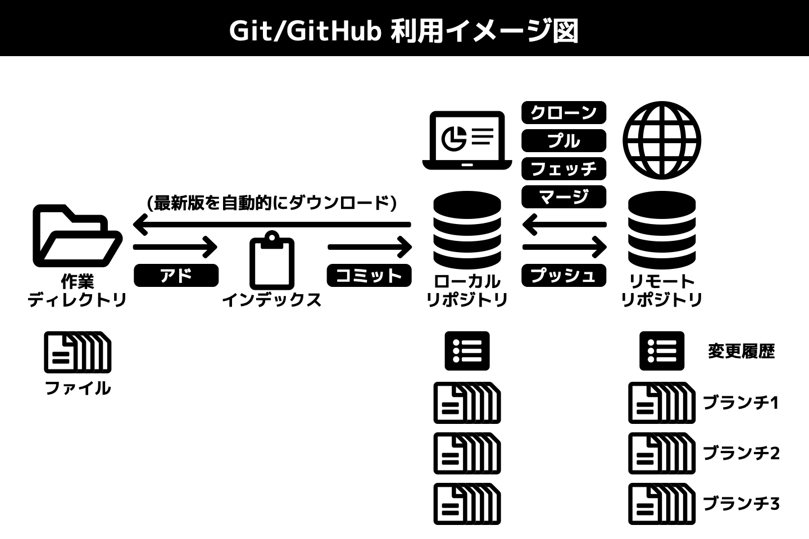

# Git用語集

## イメージ図

## 英数

### Git(ギット)

2005年にリーナス・トーバルズよって開発された、分散型バージョン管理システム

[Git]:#Git "2005年にリーナス・トーバルズよって開発された、分散型バージョン管理システム"

note:｢分散型バージョン管理｣とは、ひとつのソフトウェア開発プロジェクトに対して｢[リポジトリ]｣(ファイルの変更履歴とファイルのバックアップを保管するデータベース)を複数設置し、データの同期を定期的に行って統一性を確保する管理手法

note:分散型バージョン管理は、ソフトウェア開発プロジェクトのような、大量のファイルで構成される資料を多人数で編集する状況を想定している

note:サーバー上にインストールされたGitが原本を管理し、各開発者の手元にあるGitは原本の複製を管理する

### GitHub(ギットハブ)

[Git]互換のウェブサービス

[GitHub]:#GitHub "Git互換のウェブサービス"

note:GitHubは、Gitとの互換性を保ちながらGitにはない機能を提供し、2021年現在のオープンソースソフトウェア開発におけるバージョン管理の主流となっている

## あ行

### アド(ステージング)

[コミット]の対象とするファイルを[インデックス]に記帳すること

[アド]:#アド "コミットの対象とするファイルをインデックスに記帳すること"

### インデックス

[コミット]の対象とするファイルのリスト。未完成のファイルをコミットするミスを防ぐためにある

[インデックス]:#インデックス "コミットの対象とするファイルのリスト。未完成のファイルをコミットするミスを防ぐためにある"

## か行

### クローン

[リモートリポジトリ]を開発者各自のPCに複製し、[ローカルリポジトリ]とすること

[クローン]:#クローン "リモートリポジトリを開発者各自のPCに複製し、ローカルリポジトリとすること"

### コミット

[作業ディレクトリ]内で行われた変更を[ローカルリポジトリ]に記録すること

[コミット]:#コミット "作業ディレクトリ内で行われた変更をローカルリポジトリに記録すること"

### コンフリクト(競合)

複数人が同じファイルを変更した結果、どれを正とするか機械的に判断できず、[プッシュ]/[プル]/[マージ]が実行できない状態のこと

[コンフリクト(競合)]:#コンフリクト "複数人が同じファイルを変更した結果、どれを正とするか機械的に判断できず、プッシュ/プル/マージが実行できない状態のこと"
[コンフリクト(競合)]:#競合 "複数人が同じファイルを変更した結果、どれを正とするか機械的に判断できず、プッシュ/プル/マージが実行できない状態のこと"

### コンフリクトの解決

手作業で[コンフリクト](競合)を解消すること

[コンフリクトの解決]:#コンフリクトの解決 "手作業でコンフリクト(競合)を解消すること"

## さ行

### 作業ディレクトリ

バージョン管理の対象として指定されたフォルダ

[作業ディレクトリ]:#作業ディレクトリ "バージョン管理の対象として指定されたフォルダ"

### 上流ブランチ(の設定)

[ローカルリポジトリ]内にある特定の[ブランチ]に対し、[リモートリポジトリ]内にある特定のブランチの履歴を追跡するよう設定すること

[上流ブランチ(の設定)]:#上流ブランチ(の設定) "ローカルリポジトリ内にある特定のブランチに対し、リモートリポジトリ内にある特定のブランチの履歴を追跡するよう設定すること"

### ステージング(アド)

[コミット]の対象とするファイルを[インデックス]に記帳すること

[ステージング(アド)]:#ステージング "コミットの対象とするファイルをインデックスに記帳すること"
[ステージング(アド)]:#アド "コミットの対象とするファイルをインデックスに記帳すること"

## た行

### チェックアウト

作業する[ブランチ]を切り替えること

[チェックアウト]:#チェックアウト "作業するブランチを切り替えること"

## な行

(なし)

## は行

### パブリッシュ

[ローカルリポジトリ]で新規作成した[ブランチ]を[リモートリポジトリ]へ[プッシュ]すること

[パブリッシュ]:#パブリッシュ "ローカルリポジトリで新規作成したブランチをリモートリポジトリへプッシュすること"

### フェッチ

[リモートリポジトリ]に記録された変更を確認すること（反映はしない）

[フェッチ]:#フェッチ "リモートリポジトリに記録された変更を確認すること（反映はしない）"

### フォーク

[リモートリポジトリ]を複製して新しいリモートリポジトリをつくること。フォークを実行した者が新しいリモートリポジトリの管理者となる

[フォーク]:#フォーク "リモートリポジトリを複製して新しいリモートリポジトリをつくること。フォークを実行した者が新しいリモートリポジトリの管理者となる"

### プッシュ

[ローカルリポジトリ]に記録された変更を[リモートリポジトリ]に反映すること

[プッシュ]:#プッシュ "ローカルリポジトリに記録された変更をリモートリポジトリに反映すること"

### ブランチ

元の変更履歴タイムラインから分岐した支流のタイムライン

[ブランチ]:#ブランチ "元の変更履歴タイムラインから分岐した支流のタイムライン"

note:ひとつの[リポジトリ]の中では変更履歴はひとつのタイムライン(年表)として表現されるのが基本であるが、[Git]ではこのタイムラインを分岐させることができる

note:あるブランチに対して[コミット]を実行して変更を記録しても、他のブランチは変更されない

### ブランチのマージ

ブランチに記録された変更をマスターブランチに反映させること

[ブランチのマージ]:#ブランチのマージ "ブランチに記録された変更をマスターブランチに反映させること"

### プル

[リモートリポジトリ]に記録された変更を[ローカルリポジトリ]に反映すること

[プル]:#プル "リモートリポジトリに記録された変更をローカルリポジトリに反映すること"

### プルリクエスト

開発者が管理者に対して、自分のローカルリポジトリに記録された変更をリモートリポジトリに反映するよう求めること

[プルリクエスト]:#プルリクエスト "開発者が管理者に対して、自分のローカルリポジトリに記録された変更をリモートリポジトリに反映するよう求めること"

### 変更履歴のマージ

複数人で

## ま行

### マージ

<1>変更履歴のマージ <2>[ブランチのマージ]

### マスターブランチ

[Git]では、[リポジトリ]新規作成時に最初から存在する変更履歴のタイムラインのことをマスターブランチと呼ぶ

[マスターブランチ]:#マスターブランチ "Gitでは、リポジトリ新規作成時に最初から存在する変更履歴のタイムラインのことをマスターブランチと呼ぶ"

note:マスターとブランチの主従関係：運用の都合でマスターブランチを主・その他のブランチを従としているが、本来はすべてのブランチは対等である

## や行

(なし)

## ら行

### リポジトリ

ファイルの変更履歴とファイルのバックアップを保管するデータベース

[リポジトリ]:#リポジトリ "ファイルの変更履歴とファイルのバックアップを保管するデータベース"

### リモート追跡ブランチ

[ローカルリポジトリ]内にあって、[リモートリポジトリ]内にある[ブランチ]の変更履歴を反映させる受け皿として指定されたブランチ(指定されたからといって必ずしも内容を一致させる必要はない)

[リモート追跡ブランチ]:#リモート追跡ブランチ	"ローカルリポジトリ内にあって、リモートリポジトリ内にあるブランチの変更履歴を反映させる受け皿として指定されたブランチ"

### リモートリポジトリ

管理者がサーバに置く[リポジトリ]。ひとつのソフトウェア開発プロジェクトに対してひとつのリモートリポジトリを置く

[リモートリポジトリ]:#リモートリポジトリ "管理者がサーバに置くリポジトリ。ひとつのソフトウェア開発プロジェクトに対してひとつのリモートリポジトリを置く"

### ローカルリポジトリ

開発者各自のPC内に置くリポジトリ

[ローカルリポジトリ]:#ローカルリポジトリ "開発者各自のPC内に置くリポジトリ"

note:リモートとローカルの主従関係：運用の都合でリモートリポジトリを主・ローカルリポジトリを従としているが、本来はすべてのリポジトリは対等である

## わ行

(なし)

##  以上