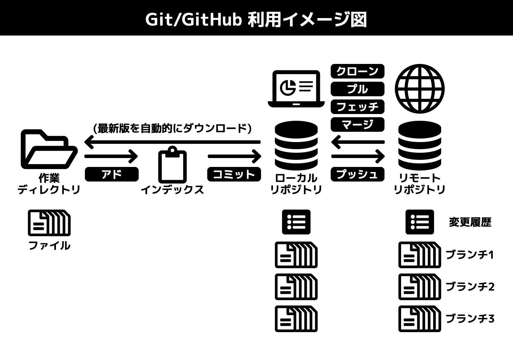

# Git用語一覧表

## イメージ図

## 用語集

| 用語                         | 内容                                                         |
| ---------------------------- | ------------------------------------------------------------ |
| リポジトリ                   | ファイルの変更履歴とファイルのバックアップを保管するデータベース |
| リモートリポジトリ           | 管理者がサーバに置くリポジトリ。ひとつのソフトウェア開発プロジェクトに対してひとつのリモートリポジトリを置く |
| ローカルリポジトリ           | 開発者各自のPC内に置くリポジトリ                             |
|  | ▽リモートとローカルの主従関係：運用の都合でリモートリポジトリを主・ローカルリポジトリを従としているが、本来はすべてのリポジトリは対等である |
| クローン                     | リモートリポジトリを開発者各自のPCに複製し、ローカルリポジトリとすること |
| 作業ディレクトリ             | バージョン管理の対象として指定されたフォルダ |
| コミット             | 作業ディレクトリ内で行われた変更をローカルリポジトリに記録すること |
| インデックス                 | コミットの対象とするファイルのリスト。未完成のファイルをコミットするミスを防ぐためにある |
| アド(ステージング)             | コミットの対象とするファイルをインデックスに記帳すること     |
| プッシュ                | ローカルリポジトリに記録された変更をリモートリポジトリに反映すること |
| プル                    | リモートリポジトリに記録された変更をローカルリポジトリに反映すること |
| フェッチ | リモートリポジトリに記録された変更を確認すること（反映はしない） |
| 変更履歴のマージ | 複数人と |
| コンフリクト(競合)              | 複数人が同じファイルを変更した結果、どれを正とするか機械的に判断できず、プッシュ/プル/マージが実行できない状態のこと |
| 競合の解決                      | 手作業でコンフリクト(競合)を解消すること                     |
| プルリクエスト  | 開発者が管理者に対して、自分のローカルリポジトリに記録された変更をリモートリポジトリに反映するよう求めること |
| ブランチ               | ひとつのリポジトリの中では変更履歴はひとつのタイムライン(年表)として表現されるのが基本であるが、Gitではこのタイムラインを分岐させることができる。分岐によってできたタイムラインの支流のことをブランチと呼ぶ。あるブランチに対してコミットを実行して変更を記録しても、他のブランチは変更されない |
| マスターブランチ             | Gitでは、リポジトリ新規作成時に最初から存在する変更履歴のタイムラインのことをマスターブランチと呼ぶ |
|  | ▽マスターとブランチの主従関係：運用の都合でマスターブランチを主・その他のブランチを従としているが、本来はすべてのブランチは対等である |
| チェックアウト | 作業するブランチを切り替えること |
| パブリッシュ | ローカルリポジトリで新規作成したブランチをリモートリポジトリへプッシュすること |
| ブランチのマージ            | ブランチに記録された変更をマスターブランチに反映させること  |
| リモート追跡ブランチ | ローカルリポジトリ内にあって、リモートリポジトリ内にあるブランチの変更履歴を反映させる受け皿として指定されたブランチ(指定されたからといって必ずしも内容を一致させる必要はない) |
| 上流ブランチ(の設定) | ローカルリポジトリ内にある特定のブランチに対し、リモートリポジトリ内にある特定のブランチの履歴を追跡するよう設定すること |
| コンフリクト           | 複数人が同じファイルを変更した結果、どれを正とするか機械的に判断できず、プッシュ/プル/マージが実行できない状態のこと |
| フォーク                     | リモートリポジトリを複製して新しいリモートリポジトリをつくること。フォークを実行した者が新しいリモートリポジトリの管理者となる |
| ............................... | ............................... |
