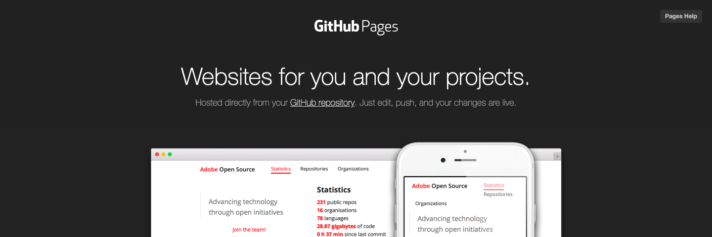

#  実践03. 完全無料のウェブサーバー！GitHub Pages

## GitHub Pagesとは



note: https://pages.github.com/

GitHub Pagesは、GitHub社の運営するレンタルウェブサーバーです。GitHubの会員であれば誰でも無料で使えます。

GitHub Pagesの最大の特徴は、ウェブコンテンツのアップロードにFTPクライアントではなくGitクライアントを使うことです。初心者にとっては高いハードルですが、個人でウェブサイトを運営するだけならばGitの機能のうちごく一部の機能だけを覚えることでGitHub Pagesを利用できます。

## GitHub Pagesの長所

### 無料で使える

GitHub Pagesは無料で使えます。広告表示の強要はありませんし、ウェブサイトを作りっぱなしで放置してもアカウント凍結されません。

### ウェブコンテンツのバージョン管理ができる

GitHub Pages上のウェブサイトは、GitHubによるバージョン管理の対象になります。ファイルの変更履歴とファイルのバックアップがGitHubに保存され、必要に応じて以前の状態に戻すことができます。

### ウェブコンテンツを多人数で編集できる

GitHub Pages上のウェブサイトは、GitHubによるバージョン管理の対象になります。GitHubはサーバー上に置かれたファイルを多人数で編集することを前提としているため、レビュー機能やプルリクエスト機能などの多人数作業の際に便利な機能があります。

## GitHub Pagesの短所

### 限定公開ができない

GitHub Pages上のウェブサイトは、ソースコードも含めて全て完全公開になります。WordPressのように、ログインしたユーザーだけにコンテンツを限定公開することはできません。

### サーバーアプリケーションが動かない

GitHub PagesはPHP言語に対応していません。WordPressのようなPHP言語で開発されたサーバーアプリケーションは動作しません。

hint: MDwikiはJavaScriptで開発されたCMSであるためGitHub Pages上で運用可能です。

## GitHub Pagesにウェブコンテンツをアップロードする

GitHub Pagesでは、ウェブコンテンツのアップロードにFTPクライアントではなくGitクライアントを使います。ここではGitクライアントとして「GitHub Desktop」を使用するものとします。

#### 手順

1. GitHub Desktopを起動
1. 変更内容を反映させたいリモートリポジトリおよびブランチを指定
1. [Commit to master]ボタンをクリック
1. [Push origin]ボタンをクリック

#### 備考

* リモートリポジトリおよびブランチを選択すると、それと対応付けされた作業ディレクトリも自動的に選択されます。
* コミットCommitにより、PC上にあるローカルリポジトリ内にファイルのバックアップが保存され、且つ、変更履歴が記録されます。
* プッシュPushにより、インターネット上にあるリモートリポジトリ内にファイルのバックアップが保存され、且つ、変更履歴が記録されます。

## プロジェクトサイトとユーザーサイト

GitHub Pageは、元々はGitHubを利用する開発者が自作ソフトウェアを紹介するためのウェブサイトを簡単に作れるようにと提供されたものです。

ソフトウェア開発プロジェクトのためにGitHub上にリモートリポジトリを設置したとして、そこにウェブコンテンツも一緒に保管すればそのウェブコンテンツがウェブサイトとして表示されます。これを「プロジェクトサイト」と呼びます。

その際のウェブサイトのURLは以下のようになります。

```
https://(ユーザーID).github.io/(リモートリポジトリ名)/
```

ではGitHub会員がたんに自己紹介をしたい時は？

その場合は、`(ユーザID).github.io`という名前のリモートリポジトリを作成してそこにウェブコンテンツを置くと、GitHub会員自己紹介用のウェブコンテンツとして扱われます。これを「ユーザーサイト」と呼びます。

その際のウェブサイトのURLは以下のようになります。

```
https://(ユーザーID).github.io/
```

## GitHub Pagesのその他の使い方

GitHub Pagesのすべての機能を説明し尽くすことはここではできませんが、GitHub PagesとMDwikiでウェブサイトを構築する手順については以下のページを参照してください。

note: [04. これだけ知ればGitHub Pageを使える！Git用語](practice04.md)

note: [05. たった2つのファイルでサイト構築・MDwiki](practice05.md)

## 関連ページ

----

###### 関連ページ

* [01. なにが違うの？GitとGitHub](practice01.md)
* [02. コマンドラインはもう不要・GitHub Desktop](practice02.md)
* <i class="far fa-hand-point-right"></i>03. 完全無料のウェブサーバー・GitHub Pages
* [04. これだけ知ればGitHub Pageを使える！Git用語](practice04.md)
* [05. たった2つのファイルでサイト構築・MDwiki](practice05.md)
* [06. 圧倒的な作業の効率化！マークダウン記法](practice06.md)
* [07. 真にミニマルなマークダウンエディタ・Typora](practice07.md)
* [08. Git対応高機能テキストエディタ・ATOM](practice08.md)
* [09. MDwikiをカスタマイズする・基本編](practice09.md)
* [10. MDwikiをカスタマイズする・HTML編](practice10.md)
* [11. MDwikiをカスタマイズする・CSS編](practice11.md)
* [12. 弱点克服！MDwikiをGoogle検索の対象にする](practice12.md)