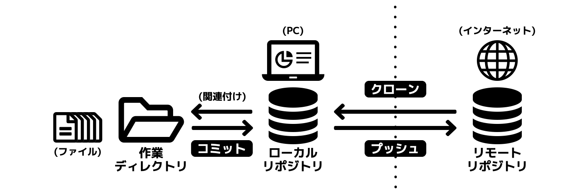

# 実践04. これだけ知ればGitHub Pageを使える！Git用語

## 知っておくべき6つのGit用語

Gitには独自の概念と用語が多く非常に難解ですが、Gitは大勢の開発者が参加するソフトウエア開発プロジェクトで用いられることを想定して作られたシステムですので、個人が小規模なウェブサイト開発をするには不要な機能も多いのです。

GitHub PagesとMDwikiでウェブサイトを構築する上で、最低限知っておくべきGit用語は以下6つです。

1. リモートリポジトリ
1. ローカルリポジトリ
1. 作業ディレクトリ
1. クローン
1. コミット
1. プッシュ

## リモートリポジトリ

リポジトリとは、ファイルの変更履歴とファイルのバックアップを保管するデータベースのことです。リポジトリの中にはすべてのバージョンのファイルが保管されています。

リモートリポジトリとは管理者がサーバーに置くリポジトリのことです。ひとつのソフトウェア開発プロジェクトに対してひとつのリモートリポジトリが用意されます。

リモートリポジトリは書類の原本を保管する場所に相当します。

## ローカルリポジトリ

ローカルリポジトリとは、開発者各自のPC内に置くリポジトリのことです。書類の複製を保管する場所に相当します。

リモートリポジトリとローカルリポジトリは定期的にデータの同期を行なって内容の同一性を保ちます。

また、ソフトウェア開発プロジェクトに参加する開発者は、新規作成あるいは編集したファイルを、まずローカルリポジトリに登録し、そののちリモートリポジトリとローカルリポジトリを同期します。

## 作業ディレクトリ

作業ディレクトリとは、ローカルリポジトリと関連付けられたフォルダのことです。

リポジトリの中にはすべてのバージョンのファイルが保管されていますが、作業ディレクトリには最新版のファイルだけが入っています。リモートリポジトリとロカールリポジトリを同期すると、作業ディレクトリの中身も更新されます。

ソフトウェア開発プロジェクトに参加する開発者は、作業として、作業ディレクトリの中にあるファイルを修正するか、または新規作成書類を作業ディレクトリに保存します。

## クローン

クローンとは、サーバー上にあるリモートリポジトリを丸ごとPC上にコピーして、それをローカルリポジトリとすることです。

クローンによって出来たローカルリポジトリは元のリモートリポジトリと関連付けられ、定期的にデータの同期を行うことになります。

## コミット

コミットとは、作業ディレクトリにあるファイルをローカルリポジトリに登録することです。

コミットにより、ローカルリポジトリにファイルのバックアップが保管され、ファイルの変更履歴が更新されます。

## プッシュ

プッシュとは、データベース同期の一種で、コミットによって生じたローカルリポジトリの変更を、リモートリポジトリに反映させることです。

コミットとプッシュにより、結果として、開発者は自分の作成した最新版のファイルを管理者に提出したことになります。

## ご参考：その他のGit用語

その他のGit用語については以下のページを参照してください。

note: URL [Git用語集](gitglossary.md)

## 関連ページ

###### 関連ページ

* [01. なにが違うの？GitとGitHub](practice01.md)
* [02. コマンドラインはもう不要・GitHub Desktop](practice02.md)
* [03. 完全無料のウェブサーバー・GitHub Pages](practice03.md)
* <i class="far fa-hand-point-right fa-fw"></i>04. これだけ知ればGitHub Pageを使える！Git用語
* [05. たった2つのファイルでサイト構築・MDwiki](practice05.md)
* [06. 圧倒的な作業の効率化！マークダウン記法](practice06.md)
* [07. 真にミニマルなマークダウンエディタ・Typora](practice07.md)
* [08. Git対応高機能テキストエディタ・ATOM](practice08.md)
* [09. MDwikiをカスタマイズする・基本編](practice09.md)
* [10. MDwikiをカスタマイズする・HTML編](practice10.md)
* [11. MDwikiをカスタマイズする・CSS編](practice11.md)
* [12. 弱点克服！MDwikiをGoogle検索の対象にする](practice12.md)