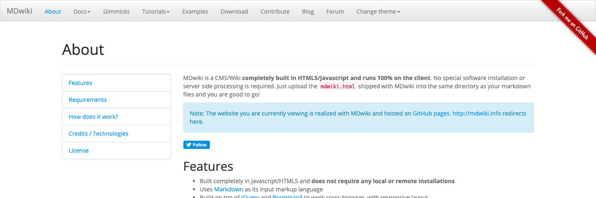

# 実践05. たった2つのファイルでサイト構築！MDwiki

## MDwikiとは



note: URL http://dynalon.github.io/MDwiki/

[MDwiki<i class="fas fa-external-link-alt"></i>](http://dynalon.github.io/MDwiki/)は、JavaScriptで開発されたシンプルで軽量なCMS(コンテンツ・マネジメント・システム)です。

MDwikiの最大の特徴は、CMSを構成するファイルがHTMLファイルひとつしかないということです。非常にシンプルでコンパクトなCMSではありますが、その代わり多機能ではありません。マークダウン記法で書かれたウェブコンテンツをHTMLに変換する以外は他に目立った機能がほとんどないという変わり種のCMSです。

なお、当サイトもMDwikiで構築されています。

## MDwikiの最小構成

最低限2つのファイルをウェブサーバー上に置けばMDwikiは動作します。サーバーアプリケーションにありがちなコマンドラインを用いたインストールは必要ありません。

### 例

##### 1. ウェブサーバー内のファイルの配置

```
(http://www.example.com/)
├ index.html　　←MDwiki本体
└ index.md　　　←ウェブコンテンツ
```

##### 2. ウェブブラウザのURL欄への入力

```
http://www.example.com/
```

##### 3. MDwikiによって転送される先のURL

```
http://www.example.com/#!index.md
```

## ウェブサイト構築の最短手順

以下に[GitHub Pages<i class="fas fa-external-link-alt"></i>](https://pages.github.com/)と[MDwiki<i class="fas fa-external-link-alt"></i>](http://dynalon.github.io/MDwiki/)を用いてのウェブサイト構築の最短手順を示します。この作業の前提として**GitおよびGitHubの使い方を既に理解している**必要があります。

##### 手順

1. MDwiki（mdwiki.html）と最初の原稿(index.md)を用意する
1. mdwiki.htmlをindex.htmlにファイル名変更する
1. GitHubで、リモートリポジトリを新規作成する
1. GitHub Desktopで、リモートリポジトリを自分のPCに[Clone]する
1. GitHub Desktopで、index.htmlとindex.mdをリモートリポジトリに[Push]する
1. GitHubで、リモートリポジトリの設定[Setting>GitHub Pages>Sourse]を＜none＞から＜master branch＞に変更する
1. 完了。数分待つとウェブサイトが公開される

## 他の方法との比較

ウェブサイトを構築するには複数の方法があり、それぞれ長所と短所があります。

### WordPressと比較

[WordPress<i class="fas fa-external-link-alt"></i>](https://wordpress.org/)は、「CMS(コンテンツマネジメントシステム)」と呼ばれるウェブアプリケーションです。ユーザーが編集者アカウントでWordPressにログインしてコンテンツを投稿すると、WordPressがそれをHTMLに変換してウェブサイトとして公開する仕組みです。

##### この方法の難点

* WordPressはGitHub Pages上で動作しない
* WordPressは多機能であるため覚えなければならないことが多い

##### MDwikiとの比較

* MDwikiはGitHub Pages上で動作する
* MDwikiはシンプル単機能であるため少数の約束事だけ覚えれば良い

### GitHub Pagesのマークダウン対応と比較

#### GitHub Pagesのマークダウン対応とは

[GitHub Pages<i class="fas fa-external-link-alt"></i>](https://pages.github.com/)自体にもマークダウン記法で書かれたウェブコンテンツをHTMLに変換して表示する機能があります。つまり「index.md」だけがあればウェブサイトとして成立します。

##### この方法の難点

* GitHub Pagesのマークダウン対応機能ではナビゲーションメニューバーが表示されない
* ウェブサイトとしてページ数を増やしていきたいのであればナビゲーションメニューバーは必須
* ナビゲーションメニューバーのためにHTMLとCSSを記述するのは時間と手間と技術知識が必要

##### MDwikiとの比較

* MDwikiは、マークダウン記法で書かれたナビゲーションメニューバーをHTML化する機能がある(自動生成はしない)

### GitHub社の推奨するJekyllと比較

#### Jekyllとは
[Jekyll<i class="fas fa-external-link-alt"></i>](http://jekyllrb-ja.github.io/)は、「静的サイトジェネレーター」と呼ばれるアプリケーションです。マークダウン記法でウェブコンテンツを作成すると、ウェブコンテンツをHTML化し、目次やナビゲーションメニューバーやその他のパーツを自動的に生成・更新してくれます。[GitHub社ではGitHub Pages上でブログを運営するためのツールとして「Jekyll」を推奨しています](https://help.github.com/en/articles/using-jekyll-as-a-static-site-generator-with-github-pages)。

##### この方法の難点
* Jekyllはコマンドライン式アプリケーションであり素人には扱えない
* JekyllはWindows上で動作しない

##### MDwikiとの比較
* MDwikiは、本体である「mdwiki.html」ファイルをウェブサーバー上に置くだけでインストールが完了する
* MDwikiは、マークダウン記法で書かれたナビゲーションメニューバーをHTML化する機能がある(自動生成はしない)

## （以後作成中）